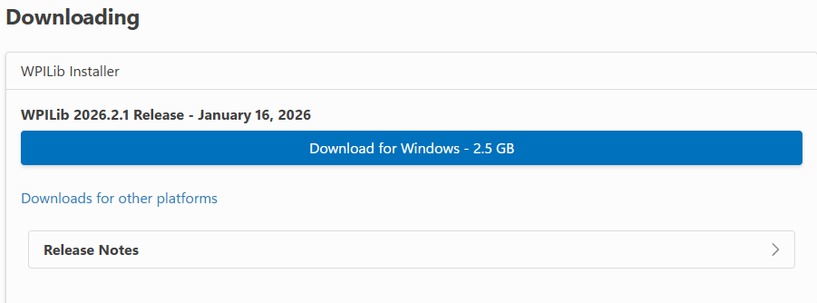

# Task 0: Configuring Computer

## Overview

It is recommended to bring your own laptop as school laptops have limitations. We have 2 drive laptops that can sometimes be used for coding, but usually they are being used to test the robot.

Installing WPILib VScode is very necessary. Normal VScode will won't work, as it is missing critical tools required to run and simulate the robot.

## Downloading WPILib

Go to https://docs.wpilib.org/en/stable/docs/zero-to-robot/step-2/wpilib-setup.html, scroll down, and download the installer.



Then follow the install instructions below the download button.

## Downloading & configuring Git

Git is also a necessary for uploading your code to the hub. Go to https://git-scm.com/install/windows and follow the install instructions in the page.

Next go to https://git-scm.com/book/ms/v2/Getting-Started-First-Time-Git-Setup to configure your user profile in order to begin using git.

## Conventions
### Naming Conventions
On ChainLynx, we use the following naming conventions

```java
// For classes
public class RobotContainer {}

// For objects,
private Subsystem elevatorSubsystem;

// For constants,

public static final double kMaxVelocity;

// For class fields,

private double speedMultiplier;
```


### Units
[The Units library](https://docs.wpilib.org/en/stable/docs/software/basic-programming/java-units.html) allows you have variables like `Distance kElevatorHeight` instead of `double kElevatorHeightMeters` The advantage of this is that the library will do all of the unit conversions for you, preventing you from making mistakes.

You can create a measure(such as Distance or Angle) using the `.of` method on a unit. For example, `Distance kBumperWidth = Inches.of(23.5)`. This will make a distance object that stores a value of 23.5 inches. You can also manipulate a measure with methods like `.plus` or `.times`. `kBumperWidth.times(2)` would return a value of 47 inches. You can also compare different measures with methods like `.lt`(less than) or `.gte`(greater than or equal to).

To use the units library you can import `import static edu.wpi.first.units.Units.*;` for the units like `Inches` or `Rotations`, and `import edu.wpi.first.units.measure.*;` for measures like `Distance` or `Angle`. When writing code try to use the units library whenever your dealing with real world values.

