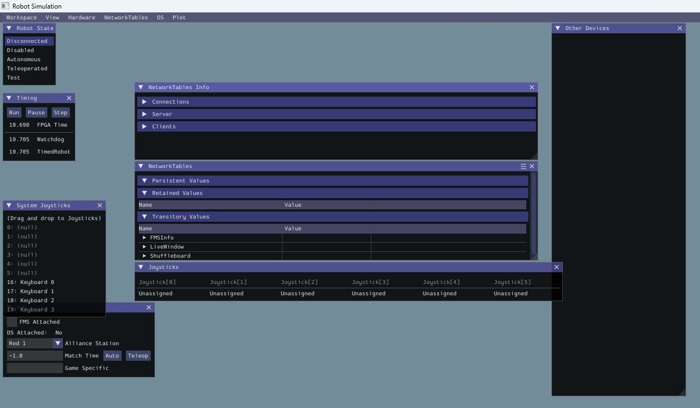

# Task 0: Configuring Computer

## Overview

It is recommended to bring your own laptop as school laptops have limitations. We have 2 drive laptops that can sometimes be used for coding, but usually they are being used to test the robot.

Installing WPILib VScode is very necessary. Normal VScode won't work, as it is missing critical tools required to run and simulate the robot.

## Downloading WPILib

Go to https://docs.wpilib.org/en/stable/docs/zero-to-robot/step-2/wpilib-setup.html#downloading,  and download the installer.


Then follow the install instructions below the download button.

## Downloading & configuring Git

Git is also a necessary for uploading your code to the hub. Go to https://git-scm.com/install/ and follow the install instructions in the page.

Next go to https://git-scm.com/book/ms/v2/Getting-Started-First-Time-Git-Setup to configure your user profile in order to begin using git.
**Whatever you set as your git name and email will be public on github**. If you dont want your actual email to be public you can use [githubs private email](https://docs.github.com/en/account-and-profile/how-tos/email-preferences/setting-your-commit-email-address)

There are a few settings that you should enable once you set your name and email.
- rerere.enabled true
- push.autosetupremote true
- pull.rebsse true
- pull.merge false
- rebase.autostash

## Connecting to the Romis
To connect to the romis, disconnect from your current wi-fi and find the romi's network. If you can't find it, here are some common causes:

- Romi is off
- Romi is out of battery
- You are attempting to connect to the wrong romi
- You have wi-fi disabled
- Your computer just doesn't work
- Someone's already connected to the romi
- Someone (100% not Ibrahim) drove the romi off a table
- Other Reasons (Please ask experienced member)

### Possible fixes
- Turn the romi on (Try both the switch and the button)
- Ask if other people are connected to the romi
- Put batteries/replace the batteries in the romi
- Restart your computer

## Sim interface



### Robot State
This is the current state of the robot. The robot can be:

- Disconnected
- Disabled
- Autonomus
- Teleoperated
- Test

Disconnected: The robot is not reciving any instructions from the computer
Disabled: It is communicating with the computer, but is unable to run any code.
Autonomus: It will run code that is preloaded. The human cannot control the robot.
Teleoperated: The human will give the robot inputs, which it will run.
Test: Never used.
### Joysticks

### Other
You will almost never need to touch the other sim elements, such as Timing and Network tables. If it is nessasary, an experienced member will tell you.

## Conventions
### Naming Conventions
On ChainLynx, we use the following naming conventions

```java
// For classes
public class RobotContainer {}

// For objects,
private Subsystem elevatorSubsystem;

// For constants,

public static final double kMaxVelocity;

// For class fields,

private double speedMultiplier;
```


### Units
[The Units library](https://docs.wpilib.org/en/stable/docs/software/basic-programming/java-units.html) allows you to store physical measurements such as distance or angle rather than just storing a number. This can help eliminate mistakes, if for example you were given a number and you thought it was in pounds but it was in kilograms. This can happen to even expericenced coders such as those at [NASA](https://en.wikipedia.org/wiki/Mars_Climate_Orbiter), so it's importiant to always use the units library where applicable.