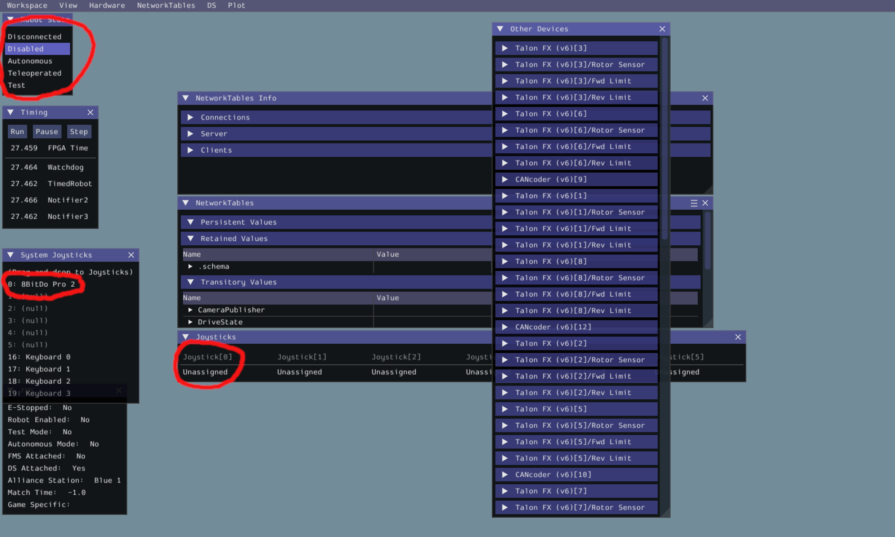

# Task 1: Controlling Romi Drivetrain and Sensors

## Resources
- [WPILib Command based programming structure](https://docs.wpilib.org/en/stable/docs/software/commandbased/structuring-command-based-project.html)
- [The anatomy of a command](https://github.com/wpilibsuite/allwpilib/blob/main/wpilibNewCommands/src/main/java/edu/wpi/first/wpilibj2/command/Command.java)
- [WPILib Romi programming docs](https://docs.wpilib.org/en/stable/docs/romi-robot/programming-romi.html)

## Running code on a romi

When writing code it is easy to make mistakes so being able to test code is very important. After each section of the task you should try running it on a romi. To run code on a romi you need to connect to its wifi network which should have the password `82488248`, after you connect to the romi click on the (WPILib VScode extention) in the top right of the screen and chose simulate robot code. After the program starts up you will see the sim window.



The most important sections of the window are the robot mode in the top left, and the joystick sections. The robot mode lets you change the mode of the robot to be differnt things like disconnected, disabled, telop, and autonomous, when you are manualy driving the robot it should be in telop. If you are using a joystick you can bind wasd to a joystick by draging keyboard 0 onto one of the joysticks.
## Conventions
### Naming Conventions
On ChainLynx, we use the following naming conventions

```java
// For classes
public class RobotContainer {}

// For objects,
private Subsystem elevatorSubsystem;

// For constants,

public static final double kMaxVelocity;

// For class fields,

private double speedMultiplier;
```

In other teams or example code, you may seem conventions like m_ObjectName for objects, and other slight variations.
Always remember to read the type and examine the usage to make sure you know what your looking at.

### Units
[The Units library](https://docs.wpilib.org/en/stable/docs/software/basic-programming/java-units.html) alows you have variables like `Distance kElevatorHeight` instead of `double kElevatorHeightMeters` The advantage of this you you can get the height in meters but also in inches or feet, the other main reason to use the units library is to avoid mismatched units like saying that a measurment in feet is in meters like what happened with the [Mars Climate Orbiter](https://en.wikipedia.org/wiki/Mars_Climate_Orbiter#Cause_of_failure).

You can create a measure(such as Distance or Angle) using the `.of` meathod on a unit eg. `Distance kBumperWidth = Inches.of(23.5)` You can also manipulate a measure with meathods like `.plus` or `.times`, and you can compare them with meathods like `.lt`(less than) or `.gte`(greater than or equal to).

To use the units library you can import `import static edu.wpi.first.units.Units.*;` for the units like `Inches` or `Rotations`, and `import edu.wpi.first.units.measure.*;` for measures like `Distance` or `Angle`. When writing code try to use the units library whenever aplicable.


## Objectives 
Off the template command-based Romi project, create a command that will allow joystick or keyboard input to control the Romi drivetrain. Create commands to drive the Romi forward and rotate it a certain amount.

## Task Details - Part 1
### Creating the project
Use the WPILib VSCode extension to create a new [Romi template (not example) command-based project](https://docs.wpilib.org/en/stable/docs/romi-robot/programming-romi.html). You will need to select several options the most important is to enable desktop suport.
### Setting up the constants file
In the constants file you need several things, because the constants are for the drivetrain you should add another class inside of constants called `DrivetrainConstatns`. The things that you need the the constants file are the drive speed, turn speed, the counts per encoder revolution, and the diameter of the wheels; the drive and turn speed should be a number between 0 and 1, however if it is to low the motors will not have enugh power to spin the wheels, the counts per revolution and wheel diameter can both be moved from the drivetrain, the only change that will need to be made is to convert the double being used to a distance in mm.

<details>
    <summary>
        <a href="Solution/src/main/java/frc/robot/Constants.java#L19">Solution</a>
    </summary>

    public final class DriveConstants {
        public static final double kDefaultDriveSpeed = 0.5; // fraction of max power, 0-1
        public static final double kDefaultRotSpeed = 0.5; // fraction of max power, 0-1
        public static final double kCountsPerRevolution = 1440.0;
        public static final Distance kWheelDiameter = Millimeters.of(70);
    }

</details>
<br>

### Drivetrain
Look at RomiDrivetrain.java in the subsystems folder. For tank drivetrains like Romi, which can’t turn and move back and forth at the same time, we use arcade drive (try to find this method) to control the Romis.

<details>
    <summary>
        <a href="Solution/src/main/java/frc/robot/subsystems/RomiDrivetrain.java#L47">Solution</a>
    </summary>

    public void arcadeDrive(double xaxisSpeed, double zaxisRotate) {
        diffDrive.arcadeDrive(xaxisSpeed, zaxisRotate);
    }

</details>
<br>

Arcade drive is a method of diffDrive, which is inside an instance of the RomiDrivetrain class, when you call Arcade drive on a RomiDrivetrain it will pass the call to the diffDrive. The parameters of arcade drive are xaxisSpeed, the speed of translation, and zaxisRotate, the speed at which we want the robot to rotate. In a differential drivetrain, the difference in the magnitudes of the individual wheel's speeds determines the speed at which the robot will rotate, and the ratios of the speed of each wheel can be used to determine the ratio of translational velocity vs rotational velocity.

If you right click on arcadeDrive called on the RomiDrivetrain instance and click 'go to definition' (F12 Shortcut), you can view the internals of WPILib's differential drive implementation for Romis. Under the hood, the speeds set on each wheel are:
```java
double leftSpeed = xSpeed - zRotation;
double rightSpeed = xSpeed + zRotation;
```
When reading robot code, understanding what each of the variables you are looking is, what their value should be, and where that value is coming from. Look at your code so far and try to figure out what each of these values, taking into account that romis have a diffdrive
T, when one wheel is spinning faster than the other, the robot will rotate in the direction of the wheel that's spinning slower.

### Commands
In WPILib there are two ways of declaring a command the first is more verbose but gives you a better idea of how a command functions under the hood.

To create the first type of commmand, in the commands folder, create a class called DriveCommand that extends the generic Command object, you can then copy the example command for the functions that you will need. We want this command to use joystick input to move the Romi around. The methods in the body of this command are from its parent class, Command, so we use the @Override annotation to signify that we're inheriting logic from the parent class.

<details>
    <summary>
        <a href="Solution/src/main/java/frc/robot/commands/ExampleCommand.java#L5">Solution</a>
    </summary>

    package frc.robot.commands;

    import edu.wpi.first.wpilibj2.command.Command;

    public class DriveCommand extends Command {

        public DriveCommand() {}

        // Called when the command is initially scheduled.
        @Override
        public void initialize() {}

        // Called every time the scheduler runs while the command is scheduled.
        @Override
        public void execute() {}

        // Called once the command ends or is interrupted.
        @Override
        public void end(boolean interrupted) {}

        // Returns true when the command should end.
        @Override
        public boolean isFinished() {
          return false;
        }
    }

</details>
<br>

In its execute method (this is periodic, so it is called for every cycle of the Command Scheduler, which is a class that manages the state of the robot program, or every 0.02 seconds) we will be calling the arcadeDrive method from the RomiDrivetrain subsystem based on joystick inputs. 

Normally, we need to track and report if the command is finished with isFinished(), but because when the robot is not doing anything else we want to be able to drive it with joysticks, we can simply let the command scheduler cancel the command when another one needs the drivetrain.


The DriveCommand’s constructor should have the following arguments:
- `RomiDrivetrain drive` (an instance of the drivetrain object, which will be defined in RobotContainer)
- `DoubleSupplier speed` (the speed at which the robot moves forward/backward)
- `DoubleSupplier rotation` (the speed at which the robot turns)

#### Why are we using Double Suppliers instead of just doubles? 
A DoubleSupplier is a [functional interface](https://www.baeldung.com/java-8-functional-interfaces) that generates doubles dynamically (when requested). Primitives(double, int, boolean, ...) won’t change once they’re passed in, but suppliers contain code that gives new doubles on the fly. Therefore, when the joystick input changes, we don’t have to create a whole new command object just to change the command inputs!

<details>
    <summary>
        <a href="Solution/src/main/java/frc/robot/commands/DriveCommand.java#L7">Solution</a>
    </summary>

    private final RomiDrivetrain drive;
    private final DoubleSupplier speed;
    private final DoubleSupplier rot;

    public DriveCommand(
        RomiDrivetrain drive, DoubleSupplier speed, DoubleSupplier rot) {
        this.drive = drive;
        this.speed = speed;
        this.rot = rot;
    
        // Use addRequirements here to declare drive dependencies.
        addRequirements(drive);
    }

</details>
<br>

In execute, call the arcadeDrive method with speed and rot as inputs

<details>
    <summary>
        <a href="Solution/src/main/java/frc/robot/commands/DriveCommand.java#L27">Solution</a>
    </summary>

    @Override
    public void execute() {
        drive.arcadeDrive(speed.getAsDouble(), rot.getAsDouble());
    }

</details>
<br>

Moving into the constructor of RobotContainer, initialize RomiDrivetrain as a variable and create a new DriveCommand.Now, initialize a Joystick() in RobotContainer, you can then use the joystick to get double suppliers for the drive command. To make a suplier you need an [anonymous function / lambda](https://www.w3schools.com/java/java_lambda.asp) which is writen with the syntax `() -> someCode` the parenthesies represent the input to the function, so in our case they are empty. After the arrow is the code that will will return a value, in this case a double.

<details>
    <summary>
        <a href="Solution/src/main/java/frc/robot/RobotContainer.java#L29">Solution</a>
    </summary>

    private final RomiDrivetrain romiDrivetrain;
    private final DriveCommand driveCommand;
    private final Joystick stick = new Joystick(0);

    /** The container for the robot. Contains subsystems, OI devices, and commands. */
    public RobotContainer() {
        romiDrivetrain = new RomiDrivetrain();
        driveCommand = new DriveCommand(romiDrivetrain, () -> joystick.getY(), () -> joystick.getX());
        // Configure the button bindings
        configureButtonBindings();
    }

</details>
<br>
It is often good style to finish object initalization in the constructor of the class you're coding, as your more explicitly specifying that you're initializing those objects when the class itself is being initialized. 

This code instantiates a RomiDrivetrain object, a Joystick object on port 0 of Driver Station, and the Drive Command you just started to create.

However this code in most cases is overkill and can be acheived in a much simpler manner by using [command compositions](https://docs.wpilib.org/en/stable/docs/software/commandbased/command-compositions.html). To create a command coposition you can use a function like `runOnce`, run, or `runEnd`, what these do is they create a command that will run the function that you give them at a certain time. In the case of `runOnce` it will run the command once in initilize and then will finish. What we need to use is `runEnd` because it takes in two functions one to run every cycle and another to run when the command ends. We can use an anonymous function to pass a function as a variable. We need to add logic to run with joystics as the first function, and the second function should stop the robot, finaly you need to add the romiDrivetrain as a requirement. We dont need to use a double supplier here is because the function is a supplier in itself, so the joystick inputs will still be updated. When you are using command compositions it can usaly be read like English, the drive command with command compositions looks like this.

<details>
    <summary>
        <a href="Solution/src/main/java/frc/robot/RobotContainer.java#L55">Solution</a>
    </summary>

    translateCommand = runEnd(() -> romiDrivetrain.arcadeDrive(translateDir * kDefaultDriveSpeed, 0), () -> romiDrivetrain.arcadeDrive(0, 0), romiDrivetrain).until(() -> romiDrivetrain.getAverageDistance().times(translateDir).gte(distToDrive.times(translateDir))).beforeStarting(runOnce(romiDrivetrain::resetEncoders));

</details>
<br>

In the end both of these methods should yeald the same result however one is much more cumbersome to write. The main advantage of a full class is in much more complicated commands like auto aline, or snap to target.

Then, in the constructor of RobotContainer, set this command to be the default command for the subsystem, so it will always be running unless it is interrupted by another command. This is why we don’t need an isFinished condition for DriveCommand because it will only ever be interrupted, not terminated. 

<details>
    <summary>
        <a href="Solution/src/main/java/frc/robot/RobotContainer.java#L61">Solution</a>
    </summary>

    romiDrivetrain.setDefaultCommand(driveCommand);

</details>
<br>

When the command runs, it should now automatically reference the controller values and respond to joystick input. Congratulations, this is now a functioning robot!

## Task Details - Part 2
Now we will use the same command logic to create rotate and translate commands. We will call the arcadeDrive method periodically, and once the translation distance or rotation angle, respectively, is reached (use sensor readings from the drivetrain), return true for the isFinished method.

### Translation command
We will now drive a certain distance using data from the drivetrain's encoders. There are methods in the drivetrain class to get the distances the encoders have traveled (`.getLeftDistance` and `.getRightDistance`). You should make a new command class called `TranslateCommand` and can copy the structure from DriveCommand. The code will be similar to the default command we wrote earlier, except we will have an finish condition that terminates the command once the desired distance is reached. We will also drive at a constant speed with no rotation.

There are two options to create the translate command you can chose which one you like better.

#### Subclass command
In the constructor you will need to take in the RomiDrivetrain and the distance to travel. After that you use [Math.signum](https://docs.oracle.com/javase/8/docs/api/java/lang/Math.html#signum-double-) to determin the sign of the distance which is the direction that we need to drive, finaly you need to add the drivetrain as a requirement for the command.

<details>
    <summary>
        <a href="Solution/src/main/java/frc/robot/commands/TranslateCommand.java#L11">Solution</a>
    </summary>

    private RomiDrivetrain drive;
    private Distance dist;
    // should be 1 or -1
    private double dir;

    public TranslateCommand(RomiDrivetrain drive, Distance dist) {
        this.drive = drive;
        this.dist = dist;

        this.dir = Math.signum(this.dist.baseUnitMagnitude());

        addRequirements(drive);
    }

</details>
<br>


After defining the constructor to access the drivetrain instance defined in Robot Container and the desired distance to travel (this is called dependency injection), we need to reset the encoder measurements to be zeroed relative to the start of the command and drive the robot at a constant translational speed until it reaches its distance setpoint.

<details>
    <summary>
        <a href="Solution/src/main/java/frc/robot/commands/TranslateCommand.java#L25">Solution</a>
    </summary>

    @Override
    public void initialize() {
        drive.resetEncoders();
    }

</details>
<br>

We multiply both the encoder distance and the distance to drive by the direction, so that if the distance is positive it will work and if the distance is negitive it will be converted to be positive. This then lets us compare them using `.gte`(greater than or equal to). Similarly, we multiply the default translation speed by the sign of the distance so we travel in the right direction. Before ending the command, we stop the drivetrain.

<details>
    <summary>
        <a href="Solution/src/main/java/frc/robot/subsystems/RomiDrivetrain.java#L30">Solution</a>
    </summary>

    @Override
    public void execute() {
        drive.arcadeDrive(kDefaultDriveSpeed * dir, 0);
    }

    @Override
    public boolean isFinished() {
        return drive.getAverageDistance().times(dir).gte(dist.times(dir));
    }

    @Override
    public void end(boolean interrupted) {
        drive.arcadeDrive(0, 0);
    }

</details>
<br>

#### Command composition
To create the command composition you will first need to use [Math.signum](https://docs.oracle.com/javase/8/docs/api/java/lang/Math.html#signum-double-) to determine the direction that you need to drive you will need to call [.baseUnitMagnitude()](https://github.wpilib.org/allwpilib/docs/release/java/edu/wpi/first/units/ImmutableMeasure.html#baseUnitMagnitude()) on the distance to get it as a double, and then save it in a variable. 

<details>
    <summary>
        <a href="Solution/src/main/java/frc/robot/RobotContainer.java#L52">Solution</a>
    </summary>

    double translateDir = Math.signum(distToDrive.baseUnitMagnitude());

</details>
<br>

Once you have the direction that the Romi needs to drive you can ceate another command with [runEnd](https://github.wpilib.org/allwpilib/docs/release/java/edu/wpi/first/wpilibj2/command/Subsystem.html#runEnd(java.lang.Runnable,java.lang.Runnable)) in this case we need to drive the romi with the speed that you stored in the constantes file times the direction, and again the function to run when the command ends shold stop the romi. Next we need to add [.until](https://github.wpilib.org/allwpilib/docs/release/java/edu/wpi/first/wpilibj2/command/Command.html#until(java.util.function.BooleanSupplier)) to the end of the command, this will give the command an end condition rather than running forever. The end condition needs to check if the robot has driven far enough, the first step is to multiply both of the distances by the direction so that both are always positive, you can then use [.gte](https://github.wpilib.org/allwpilib/docs/release/java/edu/wpi/first/units/Measure.html#gte(edu.wpi.first.units.Measure))(greater than or equal to) to check if the distance driven is farther than the distance that we need to drive. Finaly we need to add a `.beforeStarting` and a `runOnce` to reset the encoders by passing another anonymous function if you have no inputs into a function you can make it an anonymous function using `::` inbetween the class and the function rather than a `.` in this case we also dont need to put parenthesies around the end.

<details>
    <summary>
        <a href="Solution/src/main/java/frc/robot/RobotContainer.java#L59">Solution</a>
    </summary>

        translateCommand = runEnd(() -> romiDrivetrain.arcadeDrive(translateDir * kDefaultDriveSpeed, 0), () -> romiDrivetrain.arcadeDrive(0, 0), romiDrivetrain).until(() -> romiDrivetrain.getAverageDistance().times(translateDir).gte(distToDrive.times(translateDir))).beforeStarting(runOnce(romiDrivetrain::resetEncoders));

</details>
<br>

### Rotation command
This command is logically very similar to the translation command. We need to define a RomiGyro object in the drivetrain subsystem, as well as a function to get its angle, which is in degrees by default so you will need to convert it to an angle object. 

<details>
    <summary>
        <a href="Solution/src/main/java/frc/robot/subsystems/RomiDrivetrain.java#L29">Solution</a>
    </summary>

    private final RomiGyro gyro = new RomiGyro();

    public Angle getAngle() {
        return Degrees.of(gyro.getAngle());
    }

    public void resetGyro() {
        gyro.reset();
    }

</details>
<br>

#### Command class
Now create a command like in the past then, we can use the new methods in the command. You will need to reset the gyro durring initilization. We will then need to get the direction that you need to turn the same way in the translate command. Finaly you need to run the tell Romi to turn with the correct direction and speed, and tell it when to stop and to stop the wheels.

<details>
    <summary>
        <a href="Solution/src/main/java/frc/robot/commands/TurnCommand.java#L24">Solution</a>
    </summary>

    @Override
    public void initialize() {
        drive.resetGyro();
    }

    @Override
    public void execute() {
        drive.arcadeDrive(0, kDefaultRotSpeed * dir);
    }

    @Override
    public boolean isFinished() {
        return drive.getAngle().times(dir).gte(angle.times(dir));
    }

    @Override
    public void end(boolean interrupted) {
        drive.arcadeDrive(0, 0);
    }

</details>
<br>

Now you also have a rotation command!

#### Command composition

The command composition will be very similar to the one for translate command. The first step will be again to get the direction, then to run the wheels with the speed from the constants and direction, next you need to stop the drivetrain on command end, and add the drivetrain as a requirement. Finaly you need to reset the gyro before the command starts.

<details>
    <summary>
        <a href="Solution/src/main/java/frc/robot/RobotContainer.java#L54">Solution</a>
    </summary>

    double turnDir = Math.signum(distToDrive.baseUnitMagnitude());

    turnCommand = runEnd(() -> romiDrivetrain.arcadeDrive(0, turnDir * kDefaultRotSpeed), () -> romiDrivetrain.arcadeDrive(0, 0), romiDrivetrain).until(() -> romiDrivetrain.getAverageDistance().times(turnDir).gte(distToDrive.times(turnDir))).beforeStarting(runOnce(romiDrivetrain::resetGyro));

</details>
<br>

### Running your commands
In Robot Container, create a [Sendable Chooser](https://docs.wpilib.org/en/stable/docs/software/dashboards/smartdashboard/choosing-an-autonomous-program-from-smartdashboard.html) that consumes commands (SendableChooser<Command>) to add different autonomous options. Add a rotate as well as a translate command as auto options.

<details>
    <summary>
        <a href="Solution/src/main/java/frc/robot/RobotContainer.java#L42">Solution</a>
    </summary>

    private final SendableChooser<Command> autoChooser = new SendableChooser<>();

</details>

In the constructor of Robot Container, add instances of your new commands as options of the auto chooser. Finaly call `SmartDashboard.putDate(choser)` to send the autos to the dash board.
<details>
    <summary>
        <a href="Solution/src/main/java/frc/robot/RobotContainer.java#L64">Solution</a>
    </summary>

    autoChooser.addOption("drive 6 inches", translateCommand);
    autoChooser.addOption("turn 180", turnCommand);
    SmartDashboard.putData(autoChooser);
    
</details>
Great job finishing your first task!
