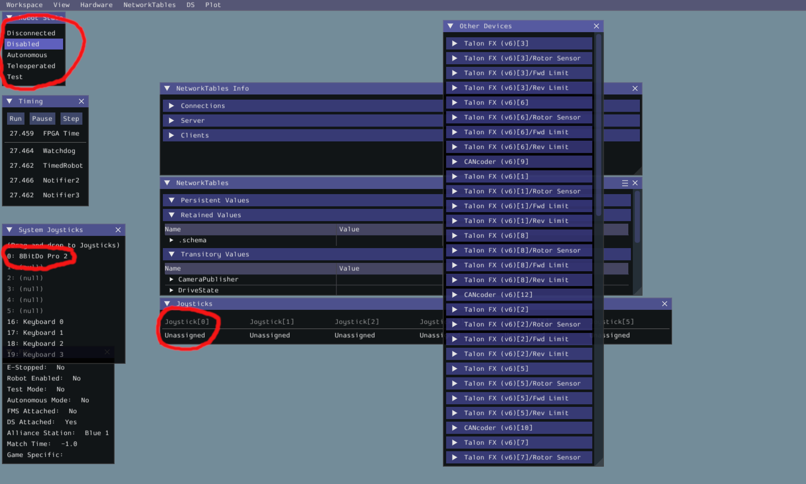
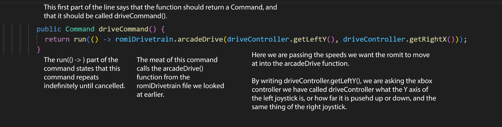

# Task 1: Controlling Romi Drivetrain and Sensors

## Resources
- [WPILib Command based programming structure](https://docs.wpilib.org/en/stable/docs/software/commandbased/structuring-command-based-project.html)
- [The anatomy of a command](https://github.com/wpilibsuite/allwpilib/blob/main/wpilibNewCommands/src/main/java/edu/wpi/first/wpilibj2/command/Command.java)
- [WPILib Romi programming docs](https://docs.wpilib.org/en/stable/docs/romi-robot/programming-romi.html)

## Running code on a romi

It is important to test your code after changes as it is easy to make mistakes. It is recommended to test the code on the Romi after each section. In order to run code on a romi, you need to connect to its wifi network, called `Romi1` or `Romi2` (printed on the bottom of the romi) with the password `82488248`. After you connecting, click on the (WPILib command palette) in the top right of your screen and choose "Simulate Robot Code". A sim window should pop up.



The most important sections are robot state in the top left and the joystick section. The robot mode lets you change the mode of the robot to be different things like disconnected, disabled, teleop, and autonomous, when you are manually driving the robot it should be in teleop. If you are using a joystick you can bind wasd to a joystick by dragging keyboard 0 onto one of the joysticks.

You can also use an xbox controller, and this is what we recommend because it is what we use on the actual robot, and so you should get used to coding for it.
## Conventions
### Naming Conventions
On ChainLynx, we use the following naming conventions

```java
// For classes
public class RobotContainer {}

// For objects,
private Subsystem elevatorSubsystem;

// For constants,

public static final double kMaxVelocity;

// For class fields,

private double speedMultiplier;
```


### Units
[The Units library](https://docs.wpilib.org/en/stable/docs/software/basic-programming/java-units.html) allows you have variables like `Distance kElevatorHeight` instead of `double kElevatorHeightMeters` The advantage of this is that the library will do all of the unit conversions for you, preventing you from making mistakes.

You can create a measure(such as Distance or Angle) using the `.of` method on a unit. For example, `Distance kBumperWidth = Inches.of(23.5)`. This will make a distance object that stores a value of 23.5 inches. You can also manipulate a measure with methods like `.plus` or `.times`. `kBumperWidth.times(2)` would return a value of 47 inches. You can also compare different measures with methods like `.lt`(less than) or `.gte`(greater than or equal to).

To use the units library you can import `import static edu.wpi.first.units.Units.*;` for the units like `Inches` or `Rotations`, and `import edu.wpi.first.units.measure.*;` for measures like `Distance` or `Angle`. When writing code try to use the units library whenever your dealing with real world values.


## Objectives 
Off the template command-based Romi project, create a command that will allow joystick or keyboard input to control the Romi drivetrain. Create commands to drive the Romi forward and rotate it a certain amount. Whenever you see words in parenthesis after another word, that is showing another name for the word that might help you figure out what it means. For example, a method is commonly referred to as a function in other coding languages, and the math meaning of the word function is more intuitive for understanding what a function is to some people.

## Task Details - Part 1

### Drivetrain
Look at `RomiDrivetrain.java` in the subsystems folder. For tank drivetrains (things that drive like a tank) such as Romis, we use whats called an arcade drive to control the Romis.

```java
    public void arcadeDrive(double xaxisSpeed, double zaxisRotate) {
        diffDrive.arcadeDrive(xaxisSpeed, zaxisRotate);
    }
```

Arcade drive is the method (function) that we will be using to drive the Romi, and whenever you call (run) `arcadeDrive()` it will tell the motors on the wheels of the Romi to move at certain speeds.

The parameters (inputs) of arcade drive are xaxisSpeed, the speed of we want the Romi to drive at, and zaxisRotate, the speed at which we want the robot to rotate.

If you want to know more about how we convert between a forward and backward, and rotational speed, click and then right click on the arcadeDrive part of `diffDrive.arcadeDrive(xaxisSpeed, zaxisRotate);` and then click 'go to definition' (F12 for a Shortcut). Here, you can view the internals of WPILib's differential drive implementation for Romis if you are interested.

When reading robot code, understanding what each of the variables you are looking is, what their value should be, and where that value is coming from can be very helpful for conceptualizing what your code will actually do when you run it.

### Commands
A Command in WPILib is a command that tells one or multiple subsystems what to do. They can be very complex, or very simple, and you can basically do whatever you want if you know how to string a set of actions together.

When looking to create a command, you should always create it in the subsystem it is controlling, or in RobotContainer if it is stringing multiple commands together.

If commands need to be made in RobotContainer for any reason, it is okay, but if you can just keep them in a subsystem you should.

The first command we want on our Romi is a command that takes in our joystick input and drives the Romi around.

To do this we want to make a `driveCommand()`, and it should look something like this. Try typing it out instead of copying it, its not that bad.

```java
    public Command driveCommand() {
        return run(() -> romiDrivetrain.arcadeDrive(driveController.getLeftY(), driveController.getRightX()));
    }
```

This "diagram" can help explain what each part of the code for building a command represents.



Next, we want to have this command be running constantly, so that whenever the Romi is enabled, it is ready to drive as soon as we move one of the joysticks.

To do this, we are going to set the default command of the drivetrain. The default command of a subsystem, such as the drivetrain, is what it runs constantly whenever no other commands are running. We want the default command of the drivetrain to be the `driveCommand()` we just made.

```java
RobotContainer() {
    romiDrivetrain.setDefaultCommand(driveCommand());
}
```

Place the middle line above into the constructor of `RobotContainer.java`. The constructor of any class (~file) contains a piece of code than runs whenever the class is initialized, and `RobotContainer.java` is initialized whenever the robot code boots for the first time. 

You can identify the constructor because it looks like a method, but shares the name of the class it is in. The constructor of `RobotContainer.java` looks like the first and third lines of the snippet above.

Now you should be able to connect to a Romi, and run your code. If you have a Romi with you, someone who knows how to do run code on them should be around, so go find them and ask for help, otherwise, you can keep moving on and hope it will work later.

## Task Details - Part 2
Now we will use the same command logic to create rotate and translate commands. We will call the arcadeDrive method periodically (constantly, just like with the `driveCommand()`), and once the translation distance or rotation angle, respectively, is reached (use sensor readings from the drivetrain), we will cancel the command.

### Translation command


Make a new command called translateCommand(), just like the drive command, but a little different. First, instead of using joystick inputs, we want the robot to simply drive forward when we press a button, not when we're holding the stick. To do this, swap out the left part of arcadeDrive() with `kDefaultDriveSpeed` which you can find in the constants file.

```java
public Command translateCommand() {
    return run(() -> romiDrivetrain.arcadeDrive(kDefaultDriveSpeed, 0));
  }
```

Next, we need to let the command know when it should be finished. To cancel a command when a certain Boolean (true / false) condition is met, we add `.until()` to the end of any command. Like with almost anything command related, we are going to need a lambda, or a () -> inside of the `.until()` method.

```java
public Command translateCommand() {
    return run(() -> romiDrivetrain.arcadeDrive(kDefaultDriveSpeed, 0))
        .until(() -> );
  }
```

This should give you an error, and for now we are going to leave it like that. First, we need to figure out how to tell if our Romi has driven a certain distance, and to do this we can use what are called encoders.

Each of the Romi's physical wheels has a mechanical component in it called an encoder. Just like a car, our Romis can tell how many miles they've driven, and this logic has been mostly set up in `RomiDrivetrain.java`, so navigate there.

You should be able to find these three methods in the file, and these are the three we will need to make our translation command. But first, we need to create a new method. 

```java
  public void resetEncoders() {
    m_leftEncoder.reset();
    m_rightEncoder.reset();
  }

  public Distance getLeftDistance() {
    return Inches.of(m_leftEncoder.getDistance());
  }

  public Distance getRightDistance() {
    return Inches.of(m_rightEncoder.getDistance());
  }
```

The two methods, `getLeftDistance()` and `getRightDistance()` will each return how many inches the left and right wheels have moved since the last time the method `resetEncoders()` was run.

To increase their accuracy, we should make a new method called `getAverageDistance()`, that takes the average of the two encoders.

```java
public Distance getAverageDistance() {
    return getLeftDistance().plus(getRightDistance()).div(2);
}
```

Now we need to go back to `RobotContainer.java` to fill in the `.until()` we left empty earlier. 

We need to add the method we just made in `RomiDrivetrain.java` into our `.until()`, and we want to constantly check if that value is greater than how far we want our Romi to drive. To do this, we can use the method `.gte()`, or which checks if the first value, before the period, is greater than or equal to the second value, in the parenthesis.

```java
public Command translateCommand() {
    return run(() -> romiDrivetrain.arcadeDrive(kDefaultDriveSpeed, 0))
        .until(() -> romiDrivetrain.getAverageDistance().gte(Inches.of(12)));
  }
```

Now, this command will tell the Romi to drive forward, but then instantly check if the encoder values are over 12 inches. If they are, the command will be instantly cancelled, and will effectively do nothing.

One problem with this command, is what happens if you have already been driving before it is ran, or if you run it twice in a row? The encoder value might already be much higher than zero, so the command will not do anything, or it won't go the full 12 inches.

Fixing this is a step up in complexity, as we need to reset our encoders every time we run the command, using the `resetEncoders()` method we looked at earlier, and then drive until we hit 12 inches.

Before the driving part of our `translateCommand()` runs, we need to call the `resetEncoders()` method. To do this we will use whats called a sequential command group, which in practice looks like using a new method, `.andThen()`.

```java
public Command exampleSequentialCommand() {
    return run(() -> {System.out.println("this");}).andThen(() -> {System.out.println("that");});
}
```

Above is a command that will print "this" and then print "that".

`.andThen()` attaches to any type of command, and whenever that command finishes, it runs a new command, back to back. This new command is what you put inside of the parenthesis of the `.andThen()` method.

In this case, we want to run `resetEncoders()`, and then (haha) the rest of the translation command.

You can kind of think of commands like sentences for robots, this command in english says, run resetting the encoders and then run the arcade drive until the average distance of the encoders is greater than or equal two 12 inches. 

Below is the old version of the command, next to the new one, so you can see the difference.

See if you can piece together which parts of the sentence correspond to each part of the code.

```java
// old
public Command translateCommand() {
    return run(() -> romiDrivetrain.arcadeDrive(kDefaultDriveSpeed, 0))
        .until(() -> romiDrivetrain.getAverageDistance().gte(Inches.of(12)));
  }

// new
public Command translateCommand() {
    return run(() -> romiDrivetrain.resetEncoders())
    .andThen(
        () -> run(() -> romiDrivetrain.arcadeDrive(kDefaultDriveSpeed, 0))
    .until(() -> romiDrivetrain.getAverageDistance().gte(Inches.of(12))));
  }
```

We need one more change for this command to be fully functional, a different version of our trusty `run()`, `runOnce()`. Instead of running a method over and over again until it gets cancelled, like `run()` does, `runOnce()` will simply run the method inside of its parenthesis once, and then cancel itself.

To change this, simply change the `run()` at the very start of the command to `runOnce()`. Besides `runOnce()` cancelling itself, they are almost completely identical.

```java
public Command translateCommand() {
    return runOnce(() -> romiDrivetrain.resetEncoders())
    .andThen(
        () -> run(() -> romiDrivetrain.arcadeDrive(kDefaultDriveSpeed, 0))
    .until(() -> romiDrivetrain.getAverageDistance().gte(Inches.of(12))));
  }
```

Now, you have a fully working translation command, but we need to bind it to a button on the Xbox Controller.

This process is super simple, and there is already an example in the `configureButtonBindings()` method in `RobotContainer.java`. This method is where all of the button bindings of the Romi (and the real robot) go, with the only kind of exception being default commands, like we saw earlier.

If you look in `configureButtonBindings()` you should see this.

```java
  private void configureButtonBindings() {
    // place button bindings here

    // when the a button is pressed, doNothing()
    driveController.a().onTrue(doNothing());
  }
```

To make the A button on the Xbox Controller run our translate command, we just need to swap out the example command, `doNothing()` with our command, `translateCommand()`. Now, when you connect to the Romi, you should be able to run your command every time you press A.

### Rotation command
This command is logically very similar to the translation command. We need to define a RomiGyro object in the drivetrain subsystem, as well as a method to get its angle, which is in degrees by default so you will need to convert it to an angle object. This method will use `gyro.getAngle()` and just like the encoder values we will need to return an angle, using `Degrees.of()`. We also need to be able to reset the gyro, so make another method called `resetGyro()` that runs `gyro.reset()`.

<details>
    <summary>
        <a href="Solution/src/main/java/frc/robot/subsystems/RomiDrivetrain.java#L29">Solution</a>
    </summary>

    private final RomiGyro gyro = new RomiGyro();

    public Angle getAngle() {
        return Degrees.of(gyro.getAngle());
    }

    public void resetGyro() {
        gyro.reset();
    }

</details>
<br>

#### Command class
Now create a file and command class called TurnCommand and copy the contents of `TranslateCommand`.
The first thing to do is change every reference of dist to angle, because these commands are trying to do the same thing but instead of a goal distance traveled, we have a goal angle turned. We need an `Angle angle` in the constructor, and we should define `dir` in the same way using `Math.signum()` again. In `initialize()` we now reset the gyro instead of the encoders, and in `execute()` we use `kDefaultRotSpeed * dir` instead of `kDefaultDriveSpeed`. Finally, in `isFinished()` we instead compare `drive.getAngle()` with the `angle` instead of the encoder distance with the distance. `end()` will stay exactly the same.

<details>
    <summary>
        <a href="Solution/src/main/java/frc/robot/commands/TurnCommand.java#L24">Solution</a>
    </summary>

    public TurnCommand(RomiDrivetrain drive, Angle angle) {
        this.drive = drive;
        this.angle = angle;
        dir = Math.signum(angle.magnitude());
        addRequirements(drive);
    }

    @Override
    public void initialize() {
        drive.resetGyro();
    }

    @Override
    public void execute() {
        drive.arcadeDrive(0, kDefaultRotSpeed * dir);
    }

    @Override
    public boolean isFinished() {
        return drive.getAngle().gte(angle);
    }

    @Override
    public void end(boolean interrupted) {
        drive.arcadeDrive(0, 0);
    }

</details>
<br>

Now you also have a rotation command! Now just like `DriveCommand` we need to make an instance of `TranslateCommand` and `TurnCommand` in `RobotContainer`. For constructing the commands, you may want to make a `kDefaultDistance` and a `kDefaultAngle` in DriveConstants, and pass them into the command constructors.

### Running your commands
In Robot Container, create a [Sendable Chooser](https://docs.wpilib.org/en/stable/docs/software/dashboards/smartdashboard/choosing-an-autonomous-program-from-smartdashboard.html) that consumes commands (SendableChooser<Command>) to add different autonomous options. 

<details>
    <summary>
        <a href="Solution/src/main/java/frc/robot/RobotContainer.java#L42">Solution</a>
    </summary>

    private final SendableChooser<Command> autoChooser = new SendableChooser<>();

</details>

In the constructor of `RobotContainer` use `chooser.addOption()` to add your translate and turn commands to the `SendableChooser`. Finally call `SmartDashboard.putData(chooser)` to send the commands to the dash board.
<details>
    <summary>
        <a href="Solution/src/main/java/frc/robot/RobotContainer.java#L64">Solution</a>
    </summary>

    chooser.addOption("drive 6 inches", translateCommand);
    chooser.addOption("turn 180", turnCommand);
    SmartDashboard.putData(chooser);
    
</details>

Then, at the bottom of `RobotContainer` have the method `getAutonomousCommand()` return `chooser.getSelected()`.

To get them to run, start the romi, and look through the tabs at the top until you see SmartDashboard, and select the sendable chooser. Select the command that you want to run, and then set the romi into `Autonomous` in the top right, and if everything went well your command should run!
