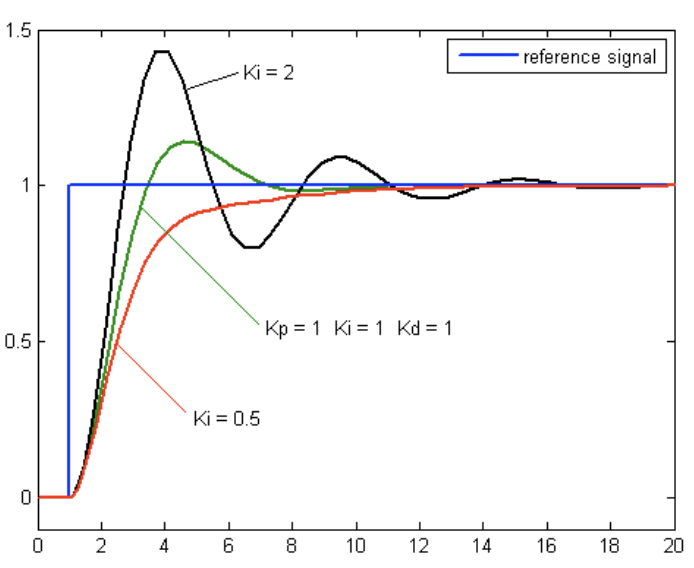

# Task 2: Basic Control Systems (PID) 

## Objectives
Implement PID to more precisely rotate and translate your robot to setpoints in order to evelop a more accurate method of robot control. 

## Resources
- [WPILib PID controllers](https://docs.wpilib.org/en/stable/docs/software/advanced-controls/controllers/pidcontroller.html)
- [PID Simulator](https://docs.wpilib.org/en/stable/docs/software/advanced-controls/introduction/tuning-flywheel.html)
- [FRC Wiki PID Controller](https://firstwiki.github.io/wiki/pid-controller)

## Task Details
Specifying a distance to travel or an angle to rotate without any control system in place will lead to over or under compensating due to factors like friction and the inertia of the object that’s in motion. Therefore, we use control systems like PID (proportional integral derivative) to adjust the motion of the moving object at each timestep based on its distance from the setpoint (using the proportional term), accumulated error (using the integral term), and rate of change of distance from the setpoint (using the derivative term).

$$\LARGE u(t) = K_{p}e(t) + K_{i}\int_{0}^{t} e(\tau) d\tau + K_{d}\frac{d}{dt} e(t)$$

Ignore the symbols for now. The second means accumulated error and the third one means the instantaneous rate of change in the error. The gains (kP, kI, kD) determine how aggressively the controller compensates for each error type. Higher values of each of the respective gains will make those control outputs more significant in influencing the output behavior of the motor. 

You must define a PID Controller object (one for rotation and one for translation) and set wheel speeds to the output of the PID controller, so the robot will be able to adaptively slow down as it approaches the setpoint. You will have to tune the gains of the PID controller to optimize its behavior. 

### Quiz: which PID controller output is best?

  

    

        <a>Answer</a>
    

    The red output signal because it converges most quickly to the desired setpoint with the least oscillation.

## Implementation
We will be modifying the project from task 1 to incorporate the PID control system to more efficiently and accurate control the Romi's behavior.

First, we will initialize PID controllers in the drivetrain and then use their control output in our rotation and translation commands to get to setpoints more precisely, since the motion of the robot will slow as the error between the current position and the setpoint decreases. 

First, instantiate the PID controllers, initializing them in the constructor of RomiDrivetrain. Note that we are using different PID gains (the constants representing kP, kI, and kD) for the different controllers since they control different aspects of the robot's motion. Later, we will plot the current robot position and setpoint on the same graph to tune these gains to more efficiently drive the Romi to setpoint.

    

        <a href="Solution/src/main/java/frc/robot/subsystems/RomiDrivetrain.java#L38">Solution</a>
    

    private final PIDController rotController;
    private final PIDController translateController;

    public RomiDrivetrain() {
    ... 

    translateController = new PIDController(0.1, 0.0, 0.0);
    rotController = new PIDController(10.0, 0.0, 0.0);
    translateController.setTolerance(DriveConstants.translationTolerance.in(Meters));
    rotController.setTolerance(DriveConstants.rotationTolerance.in(Rotations));
  }

 

Make sure to define rotation and translation tolerances in constants that represent the maximum error allowable to still be considered to be at setpoint. Then, in the constructor of Romi drivetrain, apply these tolerances to the PID controllers so we can use them to find out when the Romi have reached its setpoint.

    

        <a href="Solution/src/main/java/frc/robot/Constants.java#L25">Solution</a>
    

    public static final Distance translationTolerance = Inches.of(1);
    public static final Angle rotationTolerance = Rotations.of(0.05);

 

Now, let's define methods to calculate PID controller output based on a current position and a setpoint. Use the controller's calculate method to fetch the controller output.

    

        <a href="Solution/src/main/java/frc/robot/subsystems/RomiDrivetrain.java#L88">Solution</a>
    

    public double calculateRotOutput(double curRot, double setpoint) {
        return rotController.calculate(curRot, setpoint);
    }

    public double calculateTranslateOutput(double curDist, double setpoint) {
        return translateController.calculate(curDist, setpoint);
    }

 

Also in the RomiDrivetrain class, create methods to return whether each controller has reached setpoint based on the output of their atSetpoint methods.

    

        <a href="Solution/src/main/java/frc/robot/subsystems/RomiDrivetrain.java#L96">Solution</a>
    

    public boolean atTranslationSetpoint() {
        return translateController.atSetpoint();
    }

    public boolean atRotationSetpoint() {
        return rotController.atSetpoint();
    }

 

In the translation command from the previous task, modify the execute method so the applied translation speed is the output of the PID controller given the drivetrain's current location and the desired distance traveled. End the command once setpoint is reached. 

    

        <a href="Solution/src/main/java/frc/robot/commands/TranslateCommand.java#L26">Solution</a>
    

    @Override
    public void execute() {
        drive.arcadeDrive(drive.calculateTranslateOutput(drive.getAverageDistance().in(Meters), dist.in(Meters)), 0);
    }

    @Override
    public boolean isFinished() {
        return drive.atTranslationSetpoint();
    }

 

Implement the same logic for the rotation command, but set the applied rotation speed to be the output of the rotation PID controller. 

    

        <a href="Solution/src/main/java/frc/robot/commands/TurnCommand.java#L27">Solution</a>
    

    @Override
    public void execute() {
        drive.arcadeDrive(0, drive.calculateRotOutput(drive.getAngle().in(Rotations), angle.in(Rotations)));
    }

    @Override
    public boolean isFinished() {
        return drive.atRotationSetpoint();
    }

 

Deploy this new code to your Romi and run these commands from the Sendable Chooser on the Glass dashboard. To further improve performance, we will use an additional dependency, DogLog, to log the current Romi position and rotation as well as the respective setpoints to tune our gains. You can either select thet "WPILib Vendor Dependencies" extension from the VS Code sidebar and find "DogLog" under the "Available Dependencies" section or install this dependency by pasting this vendordep url: https://doglog.dev/vendordep.json into the WPILib Command palette under Manage Vendor Libraries -> Install New Libraries (online).

To use this dependency, in the constructor of RobotContainer, call the static method setOptions on DogLog to log everything pushed to Network Tables.

    

        <a href="Solution/src/main/java/frc/robot/RobotContainer.java#L49">Solution</a>
    

    DogLog.setOptions(new DogLogOptions().withCaptureNt(true));

 

In RomiDrivetrain, log drivetrain position, angle, and the rotation and translation setpoints (you will need to create local variables to keep track of these as they are set).

    

        <a href="Solution/src/main/java/frc/robot/subsystems/RomiDrivetrain.java#L111">Solution</a>
    

    @Override
    public void periodic() {
        // This method will be called once per scheduler run
        DogLog.log("drivetrain/position meters", getAverageDistance().in(Meters));
        DogLog.log("drivetrain/rotation degrees", getAngle().in(Degrees));
        DogLog.log("drivetrain/translation setpoint", curTransSetpoint);
        DogLog.log("drivetrain/rotation setpoint", curRotSetpoint);
    }

 

Logs can be viewed on Elastic. To set up Elastic, which is a web UI similar to Smart Dashboard and Glass (but better and more reactive), follow [these instructions](https://frc-elastic.gitbook.io/docs/getting-started/installation). Once you connect to the robot from the app, you should be able to view all your logs. 

