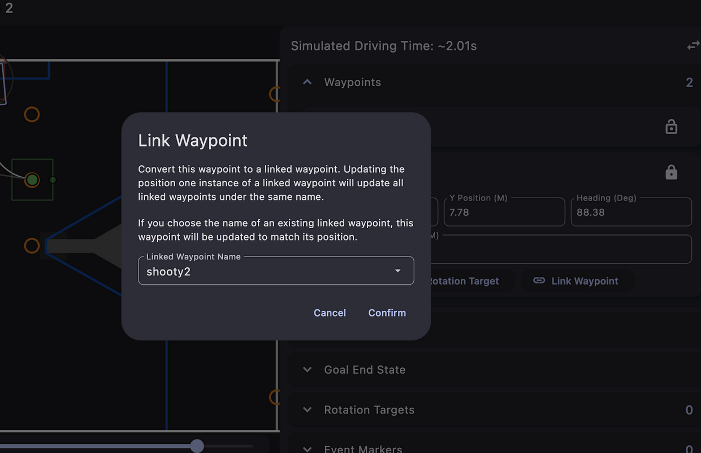

# Task 3: Path Planning

## Objectives 
Use Path Planner to create more complex autonomous routines for Romis.

## Resources 
- [Path Planner docs](https://pathplanner.dev/pplib-getting-started.html)
- [Video Overview](https://www.youtube.com/watch?v=todRXAK239g)

## Task Details -- Part 1
Instead of planning out every rotation and translation of your autos, you can get more complex movement with path planning! Start with [installing Path Planner](https://pathplanner.dev/gui-getting-started.html) on your computer. 

Experiment with [creating paths](https://pathplanner.dev/gui-editing-paths-and-autos.html#paths) (formed via adjusting your control points) and assembling paths together to [form autos](https://pathplanner.dev/gui-editing-paths-and-autos.html#autos). Besides Follow Path commands that add your paths to an auto, you can chain commands together in command groups like [sequential groups](https://docs.wpilib.org/en/stable/docs/software/commandbased/command-compositions.html#sequence) (run one after another), [parallel groups](https://docs.wpilib.org/en/stable/docs/software/commandbased/command-compositions.html#parallel) (run all at the same time), [race groups](https://docs.wpilib.org/en/stable/docs/software/commandbased/command-compositions.html#paralle) (first command that ends will stop the entire parallel group), etc. Just remember that commands that depend on the same subsystem cannot be run in parallel. The command name specifies which named command (must be bound in the code) should be run. Read about named commands [here](https://pathplanner.dev/pplib-named-commands.html).

You can also link waypoints so the next path in an auto starts in the location where the previous path ended.

  

## Task Details -- Part 2

### Create named commands 
Using your existing commands, register the commands via the Named Commands class so Path Planner will be able to recognize them when configuring autos.

### [Create paths and autos](https://pathplanner.dev/gui-editing-paths-and-autos.html) in Path Planner
- Set the Path Planner project to your code project directory.
- Create a path that drives forward for calibration purposes, add it to an auto.
- Create a path with an intermediate waypoint and chain it with another path in an auto. 
  Make sure to link start and end waypoints so the robot odometry doesn’t think it’s teleporting!

If you check the deploy directory in your code project, the path and auto jsons should show up there.

### [Set up Auto Builder](https://pathplanner.dev/pplib-getting-started.html)
[Install PathPlannerLib](https://pathplanner.dev/pplib-getting-started.html#install-pathplannerlib) as a vendor dependency in your project by clicking the wpilib logo on the left bar and then selecting it.
#### [Configure path follower](https://pathplanner.dev/pplib-getting-started.html#ltv-differential) in drivetrain
For tank drivetrains like Romis, you will have to configure a LTV path follower in the drivetrain class constructor, which is a static method on Path Planner’s Auto Builder class. This is important so the path planner knows which Romi drivetrain methods to call to move the Romi accurately. You’ll also need to create a few extra methods so you have all the necessary parameters (since the method requires Suppliers as inputs, you need to pass in the methods via the method reference operator). To get and reset the pose of the robot you need to use a Differential Drive Odometry object.
#### [Use the Auto Builder to add your autos to the auto Sendable Chooser](https://pathplanner.dev/pplib-build-an-auto.html#load-an-auto)
To create an auto object in java you need to construct a new PathPlannerAuto with the name of the auto you made in the GUI. You need to make sure that you add [named commands](https://pathplanner.dev/pplib-named-commands.html) before you construct any autos. You can then add them to the autoChoser in the same way you added the commands.
#### Test your autos in autonomous mode using the simulator!
You just need to connect to the romi and run the code, then select the auto and switch to autonomous to run the selected auto.